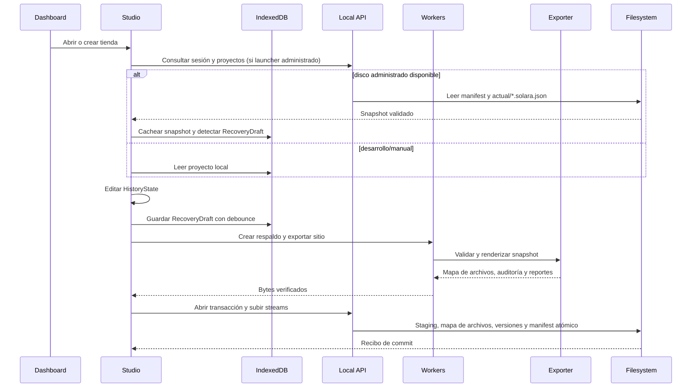

# Arquitectura de SolaraCommerce

Este documento explica cómo se relacionan Studio, el dominio, el schema, los
módulos, el exporter y el storefront. La fuente de verdad del contrato comercial
es `packages/project-schema/src/index.ts`; los nombres de los archivos de este
documento son intencionalmente concretos para que una IA pueda saltar directo al
punto de extensión.

## Vista general

```mermaid
flowchart LR
  User[Usuario] --> Studio[apps/studio<br/>React + Vite]
  Studio --> History[HistoryState<br/>undo/redo]
  History --> Core[@solara/core<br/>DomainCommand reducer]
  History --> Schema[@solara/project-schema<br/>Zod StoreProjectV2]
  Studio --> Workers[Web Workers<br/>CSV / imágenes / exportación]
  Workers --> Exporter[@solara/exporter]
  Exporter --> Modules[@solara/modules + module-sdk]
  Exporter --> Runtime[@solara/storefront-runtime]
  Exporter --> Public[HTML/CSS/JS + SEO + mapa de archivos]
  Studio --> Dexie[Dexie / IndexedDB<br/>cache + RecoveryDraft]
  Studio --> LocalAPI[Servidor local Node<br/>127.0.0.1]
  LocalAPI --> Disk[proyectos/<br/>manifest + versiones + sitios]
  Public --> Browser[Hosting estático / navegador]
  Browser --> WhatsApp[Enlace WhatsApp]
```

No existe un backend remoto. El único servidor es el proceso Node local iniciado
por `Abrir SolaraCommerce.cmd`; su API está protegida por una cookie de sesión y
queda limitada a `127.0.0.1`.

## Capas y responsabilidades

### `apps/studio`

`src/main.tsx` monta React y registra el service worker sólo en producción.
`src/App.tsx` decide si trabaja con IndexedDB o con la persistencia administrada
en disco, inicializa fixtures y coordina el dashboard y el editor.

Las vistas principales son:

- `features/Dashboard.tsx`: biblioteca de tiendas, filtros, creación, duplicado,
  archivo, respaldo, apertura del sitio local y cierre del servidor administrado.
- `features/Studio.tsx`: shell del editor, historial, tabs, preview, undo/redo,
  guardado y advertencia de salida.
- `features/GuidedOverview.tsx`: checklist `Preparar` de la plantilla Catalog
  Modern.
- `features/Overview.tsx`: identidad, contacto, WhatsApp y textos editables.
- `features/Catalog.tsx` y `features/catalog/ProductEditor.tsx`: productos,
  variantes, acciones masivas, CSV y categorías.
- `features/Builder.tsx`: secciones, inspector generado desde metadata y modo
  avanzado.
- `features/ThemeEditor.tsx`, `Assets.tsx`, `Seo.tsx` y `Export.tsx`: tema,
  recursos, auditoría y exportación.
- `features/Preview.tsx`: iframe con el mismo renderer público y transporte de
  assets por `postMessage`.

El estado de edición vive en React (`HistoryState`). No hay Redux ni un store
global externo. El historial guarda snapshots completos validados, por lo que una
operación de dominio debe ser determinista y reversible.

### `packages/project-schema`

Define schemas Zod, tipos inferidos, primitivas branded, validación de referencias,
jerarquía de categorías y migración. El proyecto persistido siempre es
`schemaVersion: 2`. `StoreProjectV1Schema` es un alias de compatibilidad usado por
paquetes que conservan el nombre histórico.

También contiene:

- `fixture.ts`: `referenceStore`, fixture pequeño de Casa Luma;
- `scale-fixture.ts`: `catalogScaleStore`, 50 productos, 9 raíces, 15 categorías
  y 60 variantes;
- `catalog-modern-fixture.ts`: `catalogModernStore`, referencia visual Modo Sur
  con 50 productos, 14 categorías y 60 variantes;
- `catalog-modern-template.ts`: fábrica `clean`/`demo`;
- `catalog-modern-guidance.ts`: requisitos de contenido y checklist;
- `catalog-modern-upgrade.ts`: plan de actualización de plantilla sin sobrescribir
  settings del usuario.

### `packages/core`

Es el dominio sin navegador. `reduceProject` aplica `DomainCommand`, recalcula
índices derivados de categorías/colecciones y valida el snapshot completo. Incluye
ajustes monetarios con enteros y `bigint`, importación/exportación CSV técnica y
comercial, y `HistoryState` para undo/redo.

### `packages/module-sdk` y `packages/modules`

`module-sdk` define `ModuleDefinition`, slots, metadata del inspector, escape de
HTML, URLs seguras, assets, rich text sanitizado y helpers de imagen/video.
`modules` registra las definiciones legacy y Catalog Modern. El registry valida
compatibilidad de slot, crea defaults y conserva sólo settings declarados como
compatibles al reemplazar un módulo.

### `packages/exporter`

Es el renderer público y el origen de todos los artefactos exportados. El flujo
principal es:

```text
StoreProjectV2
  -> parseProject
  -> buildCommerceSnapshot
  -> optimizeProject / auditProject
  -> createPublicExportManifest
  -> buildPages
  -> renderDocument + renderSections
  -> buildFiles
```

`buildPages` genera home, categorías paginadas, colecciones, productos, búsqueda,
contacto, nosotros, carrito, compra y políticas. `buildFiles` produce el mapa de
archivos del sitio (CSS, runtime, assets, `robots.txt`, sitemaps, JSON-LD,
Merchant y contexto público opcional); Studio lo envía al servidor local, que
escribe la carpeta `sitios/<versión>/`. Production bloquea errores críticos;
draft mantiene `noindex` y permite revisar.

`renderPreviewHtml` usa las mismas páginas y módulos con un transporte especial de
assets para el iframe. No debe crearse un renderer alternativo dentro de Studio.

### `packages/storefront-runtime`

El archivo exportado contiene una cadena de JavaScript y otra de CSS generadas a
partir de este paquete. `storefrontBoot` detecta capabilities en el documento y
activa sólo lo necesario: carrito, variantes, galería, búsqueda, filtros, menú,
hero/video y motion. El carrito usa `localStorage` con clave
`solara-cart:{storeId}` y reconcilia datos contra `catalog-index.json`.

### `packages/site-optimizer`

Es una auditoría pura y determinista. No modifica el proyecto. Calcula hallazgos,
score, rutas, cobertura de contenido, media, Merchant y contexto IA. El exporter
usa ese mismo snapshot para no producir divergencias entre HTML, JSON-LD, feed y
archivos para agentes.

## Ciclo de vida de una tienda



### Creación

`createProject` llama a `buildCatalogModernProject({ seed: "clean" })`, asigna un
ID/slug y embebe los assets de plantilla como data URLs para que la tienda nueva
sea autocontenida. No copia productos, categorías ni colecciones de la demo.

### Migración al disco

Cuando se usa el servidor administrado, `App` lee primero `proyectos/`. Los IDs que
sólo existen en IndexedDB se migran como primera versión; si un mismo ID difiere,
la versión de disco gana y la versión del navegador se guarda como
`RecoveryDraft`. La migración conserva los registros de IndexedDB porque allí aún
pueden existir borradores o caché.

### Guardado

`ManagedPersistenceControls` distingue cambios confirmados de borradores. El flujo
no informa “Guardado” hasta recibir el recibo del servidor. Si production falla,
se confirma el respaldo `.solara.json` y el manifest queda `site-outdated`, sin
reemplazar el último sitio válido.

## Persistencia

En modo administrado, la estructura es:

```text
proyectos/<slug-inicial>--<id-corto>/
├── manifest.json
├── recovery.json             (sidecar de diagnóstico, sólo si hay error)
├── actual/<version>.solara.json
├── respaldos/<version>.solara.json
├── respaldos-manuales/
└── sitios/<version>/index.html ...
```

`manifest.json` es el puntero autoritativo. El servidor usa staging bajo
`.solara-runtime/storage`, hashes SHA-256, límites de tamaño/archivos del mapa
del sitio, validación de rutas relativas y rename atómico del manifest. El
sitio se escribe desde un mapa de archivos JSON sin descompresión, por lo que
no existe superficie Zip Slip. El almacenamiento expone además:

- `writeGuard` (sólo tests): simula fallos deterministas de escritura
  (disco lleno, permisos, reintento) sobre las ops `write-upload`,
  `write-site-files`, `rename-site`, `copy-archive`, `write-manifest` y
  `remove-old-current`; el handler nunca lo inyecta.
- matriz de reparse points: `assertNoReparsePoints` rechaza junctions/symlinks
  dentro de `proyectos/`, fijada por `reparse-points.test.mjs`.
- sidecar `recovery.json` por carpeta: persiste el diagnóstico de un manifest
  dañado entre reinicios y se elimina cuando la carpeta vuelve a estar sana.
- `POST /__solara/storage/projects/{projectId}/open-folder`: devuelve la
  carpeta de la tienda; el handler la abre en Explorer en Windows y en otras
  plataformas sólo confirma la ruta.
- sentinel de migración a disco: la tabla `migrations` de Dexie registra
  `pending`/`done` por proyecto para retomar migraciones interrumpidas.

La explicación de endpoints está en
[`docs/INTEGRATIONS.md`](INTEGRATIONS.md); recovery y rollback, en
[`docs/backup-and-recovery.md`](backup-and-recovery.md).

## Decisiones arquitectónicas

- Monolito modular pequeño, sin orquestador adicional.
- Schema como fuente única de tipos, validación, persistencia y exportación.
- HTML Light DOM y mejora progresiva en lugar de depender de JavaScript para SEO.
- Módulos precompilados; el navegador no compila código del usuario.
- Regeneración determinista completa antes de introducir caché incremental.
- Workers para CSV, imágenes y exportación pesada.
- Chromium en el bucle local; release separado para la matriz completa.

Las decisiones históricas están en [`architecture-decisions.md`](architecture-decisions.md).

## Puntos de extensión futuros

- Añadir migraciones explícitas después de `schemaVersion: 2`.
- Revisar los límites del mapa de archivos del sitio si una exportación deja de
  caber cómodamente en memoria.
- Añadir sincronización remota sólo como una capa nueva, sin convertirla en
  requisito del storefront.
- Incorporar nuevos módulos mediante el SDK y no mediante HTML arbitrario.
- Separar componentes grandes de Studio sólo con tests de comportamiento y sin
  cambiar el contrato público.
